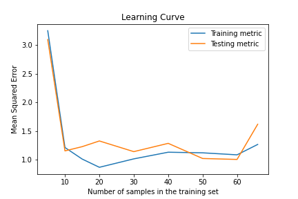

# Learning Curves

## Introduction

This is a repository of example Python code for plotting [learning curves](#background-on-learning-curves) for [Pytorch](https://github.com/pytorch/pytorch) supervised machine learning models.  A number of model and plotting variations are demonstrated in [Jupyter](https://jupyter.org/) notebooks.

For example, the Jupyter notebook [notebooks/linear_regression.ipynb](notebooks/linear_regression.ipynb) demonstrates how to plot the learning curve below for a simple linear regression Pytorch model.

The learning curve is one where the x-axis represents training set size, not the more common number of training loop iterations.  Please open an [issue](https://github.com/AlexGose/learning-curve/issues) if you know of any such publicly available examples for Pytorch models, and I will list them here.

## Features

The example notebooks produce learning curve plots with the following features:

1. [notebooks/linear_regression.ipynb](notebooks/linear_regression.ipynb) shows how to control the cross validation splitting strategy and scoring metric for a simple linear regression Pytorch model
2. [notebooks/pipeline.ipynb](notebooks/pipeline.ipynb) shows how to use a scikit-learn Pipeline object for scaling input data for a neural network Pytorch classification model
3. [notebooks/gpu_minibatch.ipynb](notebooks/gpu_minibatch.ipynb) shows how to use GPU processing and mini-batch gradient descent with a Pytorch model and the [MNIST](http://yann.lecun.com/exdb/mnist/) data set.  Here, the skorch object is re-used for test and training accuracy calculations as well as a confusion matrix plot with scikit-learn

## Benefits of Learning Curves

Learning curves based on the number of training examples, along with a desired level of performance, are useful for diagnosing problems with a model, such as high bias or high variance.  Andrew Ng provides some examples of these plots in his "Machine Learning" course taught in CS229 at Stanford (see [lecture 13](https://www.youtube.com/watch?v=ORrStCArmP4&list=PLoROMvodv4rMiGQp3WXShtMGgzqpfVfbU&index=13)).  Learning curves are also used to assess whether or not to collect more training data (see Mohr and van Rijn).

## Software

These noteworthy Python packages are related to plotting learning curves for supervised machine learning.  Some are not designed to work with Pytorch directly, and some do not produce learning curves for increasing numbers of training set sizes. Please open an [issue](https://github.com/AlexGose/learning-curve/issues) to suggest a package to add to the list.

| Software | Actively Maintained | sklearn models | Pytorch models | Real-time | Browser | iteration LC | train set size LC |
| :---: | :---: | :---: | :---: | :---: | :---: | :---: | :---: |
| [Pierogi](https://github.com/nalepae/pierogi) |  X  | X   |  ✓    |  ✓   |  ✓   |   ✓  |  X  |
| [scikit-learn](https://scikit-learn.org/stable/modules/learning_curve.html#learning-curve) | ✓  | ✓  | X | X | X | ✓  | ✓  |
| [skorch](https://github.com/skorch-dev/skorch) | ✓  | X | ✓  | X | X | X | X |
| [TensorBoard](https://www.tensorflow.org/tensorboard/) ([torch.utils.tensorboard](https://pytorch.org/docs/stable/tensorboard.html)) | ✓  | X | ✓  | ✓  | ✓  | ✓  | X |
| [Yellowbrick](https://www.scikit-yb.org/en/latest/api/model_selection/learning_curve.html) | ✓  | ✓  | X | X | X | ✓  | ✓  |

- LC = Learning Curve
- ✓  = Indicates "yes", "supported", or within the intended scope of the project
- X = Indicates "no", "not supported", or not within the intended scope of the project

Note: These software packages have different goals and purposes, and this table is only meant to give a quick impression.  One is not better than the other based on number of check marks or some other arbitrary measure.  For example, skorch does not support plotting learning curves since it is designed to facilitate the use of sklearn, where such tasks are supported, for Pytorch models.

## Background on Learning Curves

The term ["learning curve"](https://en.wikipedia.org/wiki/Learning_curve_(machine_learning)) used here is specifically for supervised machine learning.  The term has a longer history of use outside of machine learning (see Viering and Loog) .  In the field of machine learning the term was originally used for reinforcement learning (See Mohr and van Rijn).

There are at least two types of learning curves in supervised machine learning.  The first and maybe the most common is a plot used to show progress of stochastic gradient descent for training machine learning models, such as neural networks.  Some measure of progress, average loss or accuracy, is displayed on the y-axis.  The x-axis usually represents number of iterations of the training loop or cumulative time for each iteration.

After writing the code to train a neural network, this first type of learning curve requires minimal additional programming effort, since the data for the curve can be easily obtained during training and displayed after training.  With these plots, we are generally interested in seeing curves for both the set of data used to train the model and the test set of data in the same graphical display.

Another type of learning curve, and the focus of this project, also plots some measure of performance on the y-axis.  However, the x-axis represents the number of observations used to train the model.  This means that the model must be fully trained at least once for each training set size of interest.  This can be computationally prohibitive for large data sets or large neural network models, but the benefits may outweigh the cost.

## References

- Mohr, Felix, and Jan N van Rijn. “Learning Curves for Decision Making in Supervised Machine Learning–A Survey.” ArXiv Preprint ArXiv:2201.12150, 2022. <https://arxiv.org/pdf/2201.12150.pdf>.
- Ng, Andrew. Lecture 13 "Debugging ML Models and Error Analysis", Stanford CS229 Machine Learning (Autumn 2018) lecture video (<https://www.youtube.com/watch?v=ORrStCArmP4&list=PLoROMvodv4rMiGQp3WXShtMGgzqpfVfbU&index=13> at 16:00)
- Viering, Tom, and Marco Loog. “The Shape of Learning Curves: A Review.” IEEE Transactions on Pattern Analysis and Machine Intelligence, 2022. <https://arxiv.org/pdf/2103.10948.pdf>.

## Acknowledgments

Thank you to the people who contributed to the projects mentioned here.

## Author

Alexander H Gose

## License

[MIT License](LICENSE)
